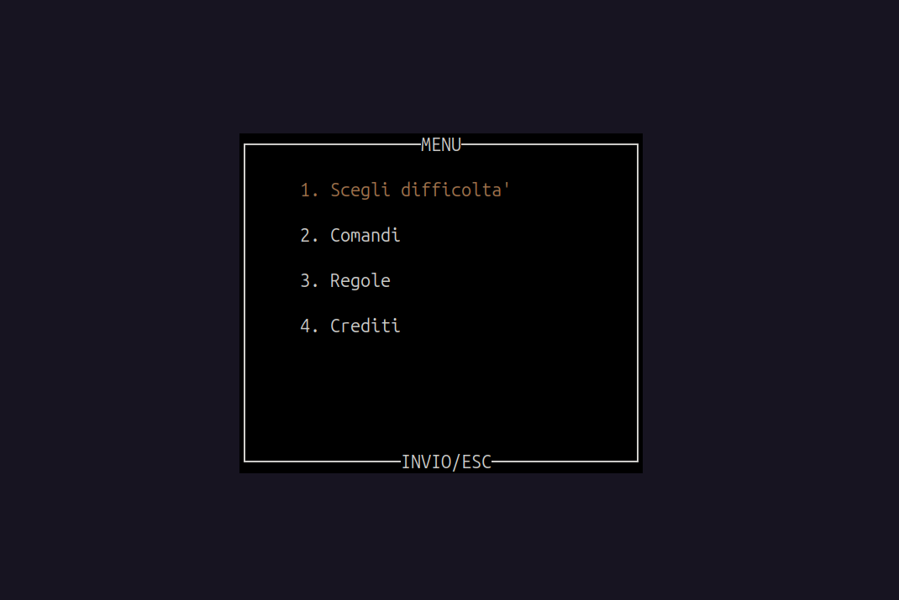

# Frogger Resurrection - Operating Systems Project (SOPR)

This repository contains the implementation of the videogame Frogger Resurrection, developed as the final project for the Operating Systems course (A.Y. 2024-2025, University of Cagliari). The software simulates the classic vintage arcade game, focusing on concurrency management and inter-process communication (IPC) in a Linux environment.  

## 👥 Authors
The project was developed by:
- Contu Mauro (ID: 60/79/00115)
- Caruso Marco (ID: 60/79/00107)

## 🛠️ Requirements & Installation
The project is designed to run on Ubuntu 22.04 LTS (64-bit). You must install the ncurses library (for terminal graphics) and SDL2 (for audio support).  To install the dependencies, run:
```bash
sudo apt update
sudo apt install libncurses5-dev libsdl2-dev
```

## 🚀 Compilation and ExecutionThe project uses a Makefile to manage the build process.  Compilation:
```Bash
make
./output
```


Upon execution, a splash screen will appear; press any key to enter the Main Menu.

## 🎮 Game Guide
### Menu Structure
The menu offers four options selectable via arrow keys and the ENTER key:

1 - Select Difficulty: Start a new run by choosing your preferred challenge level.

2 - Controls: View a brief description of the keys used to move the frog.

3 - Rules: A description of the game mechanics and objectives.

4 - Credits: Information regarding the project developers.



### Objectives and Mechanics
- Goal: Guide the frog from the starting sidewalk to fill all 5 nests located at the top of the screen.
- Obstacles: Cross the river by jumping on crocodiles (acting as rafts) while avoiding falling into the water.
- Lives: You have a fixed number of lives (default: 5).
- Time: Each round must be completed before the timer expires.
- Combat: The frog can fire two grenades (left and right) by pressing the Spacebar to neutralize crocodile projectiles.


### Difficulty and Scoring
The game starts with a base score of 200 points. Difficulty affects the speed of crocodiles and their projectiles, as well as the score balance:

| Event | Easy | Medium | Hard |
| :--- | :---: | :---: | :---: |
| **Final Victory** | +1000 | +1500 | +2000 |
| **Nest Closed** | +100 | +250 | +500 |
| **Projectile Neutralized** | +5 | +5 | +5 |
| **Life Lost** | -10 | -15 | -20 |
| **Game Over** | -100 | -250 | -500 |
| **Time Penalty** | -1 every ~6s | -1 every ~6s | -1 every ~6s |


## 🏗️ Technical Architecture
The project is based on an N-Producers / 1-Consumer architecture, where multiple independent entities generate data sent to a central manager responsible for game logic and rendering.  

### 1. Process Version (/versione_processi)
In this version, parallelism is managed at the operating system level.  
- Parallelism: Every dynamic object (frog, crocodiles, and projectiles) is implemented as a single separate process generated via fork().
- Communication (Pipes): A single pipe is mandatory for communication from the producer processes to the consumer process.
- Graphics Manager: A central process (consumer) receives coordinates, manages drawing via the ncurses library, and verifies collisions or objects leaving the screen.
- Synchronization: The pipe structure ensures that messages are processed in order, avoiding simultaneous writing conflicts.

### 2. Thread Version (/versione_thread)This version leverages memory sharing within a single address space.  
- Parallelism: Each game entity (frog, crocodiles, and projectiles) is managed as an independent thread using the pthread library.
- Communication (Shared Memory): Communication between producer threads and the consumer thread occurs through a producer-consumer buffer in shared memory.
- Synchronization (Mutex & Semaphores): Access to the buffer is strictly regulated to prevent race conditions:
- Circular Buffer: The buffer is implemented as a limited, circular array structure.  Semaphores/Mutex: pthread synchronization tools are used to protect buffer slots from concurrent writes or overwriting unconsumed data.


## 📋 Submission Notes

The project has been fully tested and is functional on Ubuntu 22.04 LTS (Native installation). The program complies with the mandatory single-task architecture for moving objects (frog, crocodiles, projectiles). 
The repository follows the required structure, containing both /versione_processi and /versione_thread subdirectories with their respective source files and Makefiles. The code is fully compilable and executable according to the course standards.  
